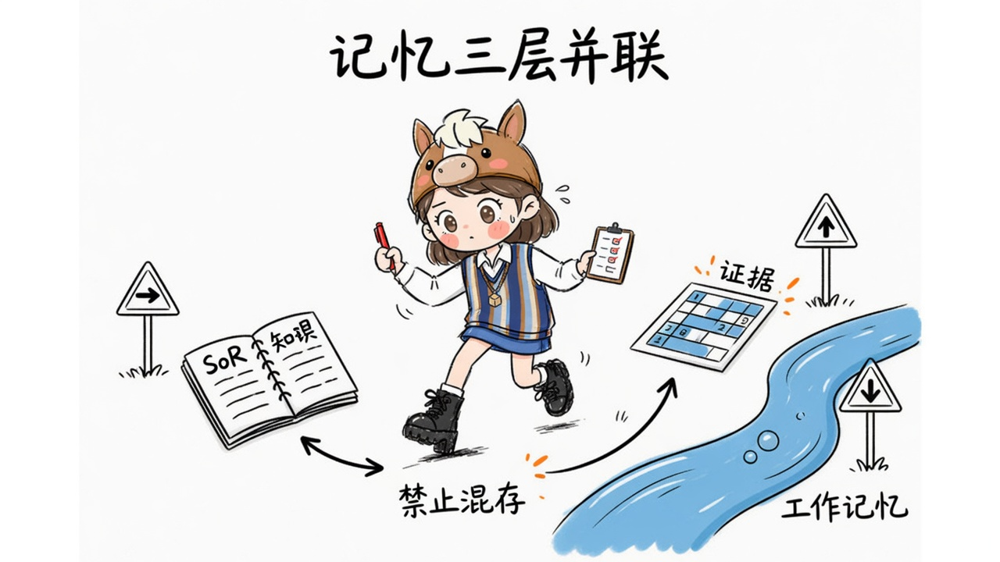
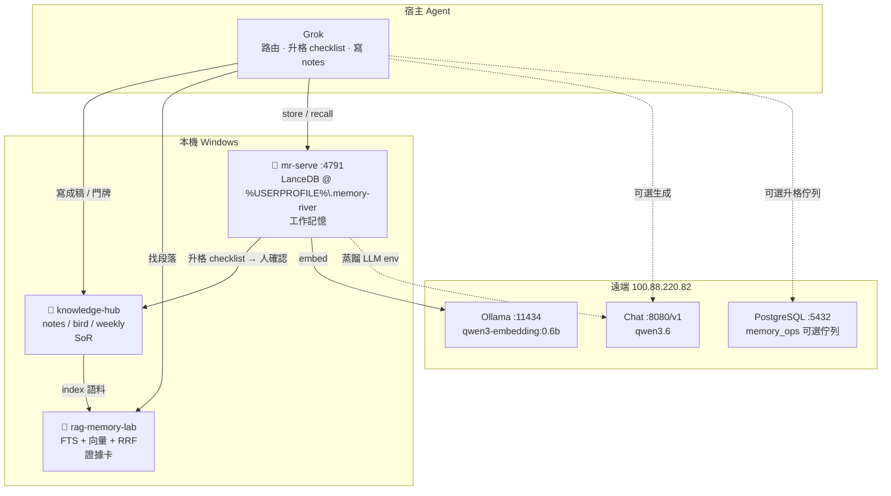
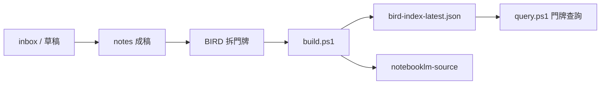
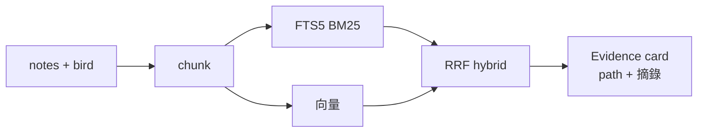
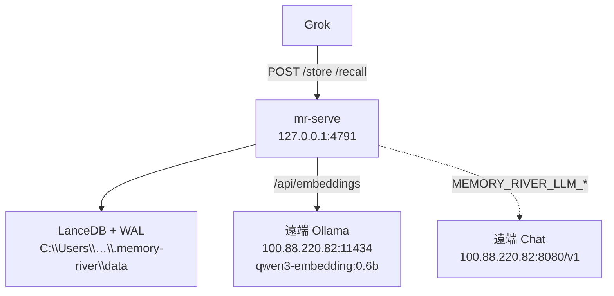
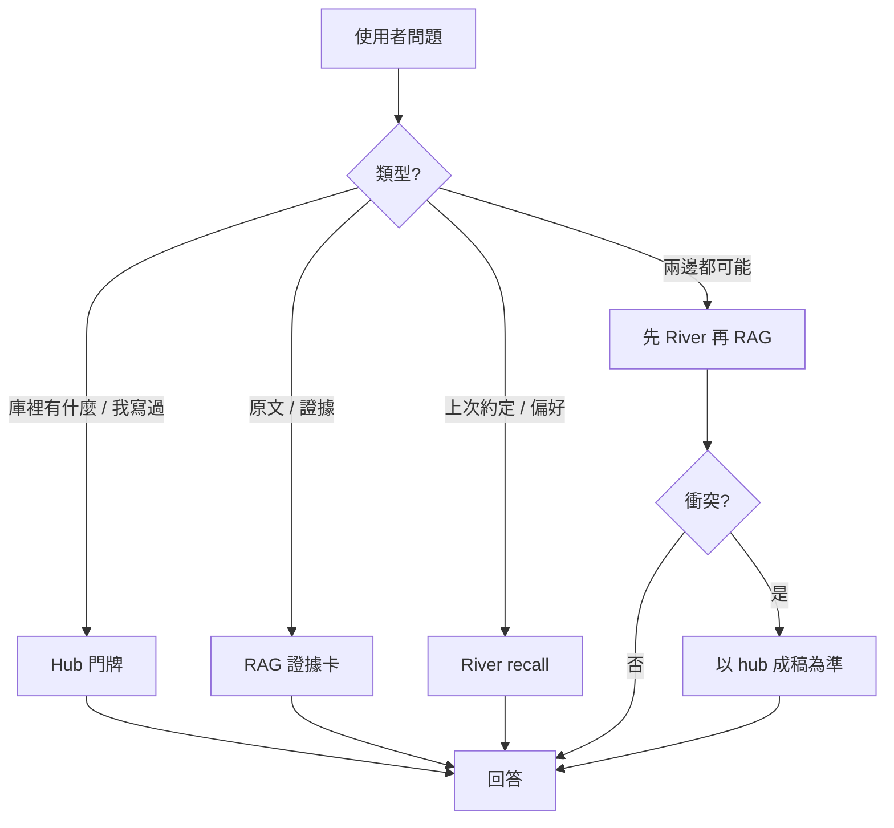
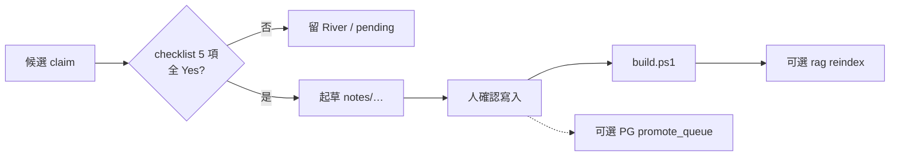

# 記憶三層 · 架構與說明

> 視覺總覽：用瀏覽器開 [`memory-layers-architecture.html`](./memory-layers-architecture.html)  
> 邊界鐵律：[`memory-layers.md`](./memory-layers.md)  
> Grok skill：`Grok skill（本機）`  
> 配圖（gimi-illustration）：[`../gimi-illustration-skill/outputs/20260714-memory-layers/`](assets/memory-layers/)

---

## 0. 一句話

三條**並聯**管線，各管一件事：

| 層 | 一句話 |
|----|--------|
| **knowledge-hub** | 人寫的**唯一真相**（SoR） |
| **rag-memory-lab** | 對真相做**找段落**（證據卡） |
| **Memory River** | Agent 的**工作記憶**（偏好／約定／決策） |

宿主只有 **Grok**。升格單向、人確認；**禁止**自動雙向同步。



> SoR 成稿 · 證據卡找段落 · River 工作記憶——**禁止混存**。配圖：gimi-illustration · quirky-sketch。

---

## 1. 系統總覽圖



---

## 2. 為什麼分三層（問題 → 解法）

| 若混在一起 | 會怎樣 | 我們的切法 |
|------------|--------|------------|
| 筆記全塞向量庫 | 沒門牌、難週檢、雙真相 | **hub = 人編 SoR** |
| 只用聊天記憶當知識庫 | 數字／出處會漂、難稽核 | **rag = 可追溯段落** |
| 文件 chunk 當「我記得你喜歡…」 | 代謝／衝突語意不對 | **River = 對話工作記憶** |
| 全自動雙向 sync | 吵、難 debug、誰覆蓋誰不明 | **單向升格 + 人確認** |

---

## 3. 各層內部

### 3.1 knowledge-hub（SoR）



| 路徑 | 角色 |
|------|------|
| `notes/` | 真相正文 |
| `bird/` | 門牌結構 |
| `weekly/` | 週檢輸出 |
| `build.ps1` | 建索引（寫） |
| `query.ps1` | 查門牌（讀，不重建） |

**定位規則：** 先 `B / I.K / Summary / D`，禁止一開始全文掃 notes。

---

### 3.2 rag-memory-lab（證據）



| 指令 | 用途 |
|------|------|
| `uv run python workspace/index_workspace.py` | 重建索引 |
| `uv run python workspace/query_workspace.py "…"` | 查詢 |

**不做：** 生成答案、當跨 session 偏好庫。

---

### 3.3 Memory River（工作記憶）



| API | 用途 |
|-----|------|
| `GET /health` | 探活 |
| `POST /store` | 寫入事實／偏好 |
| `POST /recall` | 粗召回 |
| `POST /rehydrate` | 回原文 turns |
| `POST /archive-transcript` | 歸檔對話 |

**硬限制**

- dataDir **必須本機 NTFS**（`J:` 會 Lance 失敗）
- **僅 loopback**，勿對外
- **本機 Ollama 已移除**，embed 只靠遠端
- 主存不是 Postgres

---

## 4. 查詢路由（Grok）


> ①門牌 · ②證據 · ③偏好——問題類型決定主路徑。



觸發：

```text
讀取 Grok skill（本機），依三層邊界處理：…
```

---

## 5. 升格流程（River → Hub）


> ①候選 · ②清單 · ③notes——**人確認**；禁止自動雙寫。



**Checklist（全 Yes 才寫 notes）**

1. 30 天內會再引用？  
2. 需要門牌／週檢／給未來的自己看？  
3. 不該只靠 agent 記得？  
4. hub 尚無等價成稿？  
5. 一句話可獨立理解、非一次性噪音？  

---

## 6. 部署拓撲

```text
┌────────────────────── 本機 Windows ──────────────────────┐
│  Grok                                                    │
│  knowledge-hub / rag-memory-lab                          │
│  mr-serve ──────► 127.0.0.1:4791 （loopback only）       │
│  LanceDB  ──────► %USERPROFILE%\.memory-river\data       │
│  ❌ 無本機 Ollama                                          │
└─────────────┬──────────────────────┬─────────────────────┘
              │ embed                │ chat / 可選 PG
              ▼                      ▼
┌────────────────── 100.88.220.82（Tailscale）─────────────┐
│  :11434  Ollama  qwen3-embedding:0.6b （1024 維）        │
│  :8080   Chat Completions  qwen3.6                       │
│  :5432   PostgreSQL  memory_ops（升格佇列，非 River 主存） │
│  :5050   Adminer                                         │
└──────────────────────────────────────────────────────────┘
```

| 元件 | 位置 | 可丟可重建？ | 要備份？ |
|------|------|--------------|----------|
| notes / bird / weekly | 本機 hub | 否 | **要** |
| rag artifacts | 本機 | 是 | 可不要 |
| River LanceDB | 本機 C: | 部分 | **要**（狀態） |
| Ollama 模型 | 遠端 | 可 re-pull | 可不要 |
| memory_ops | 遠端 PG | 是 | 可選 |

---

## 7. 日常操作速查

```powershell
# River
.\.local\memory-river\start-mr-serve.ps1
.\.local\memory-river\smoke-test.ps1

# Hub
.\knowledge-hub\build.ps1
.\knowledge-hub\query.ps1

# RAG
cd rag-memory-lab
uv run python workspace/index_workspace.py
uv run python workspace/query_workspace.py "你的問題"

# 探活
.\docs\probe-memory-layers.ps1
mr doctor
```

瀏覽器開架構圖：

```powershell
start J:\grok\34\docs\memory-layers-architecture.html
```

---

## 8. 衝突與優先級

```text
hub 成稿  >  River 蒸餾  >  模型臆測
門牌導航  >  一開始全文掃 notes
證據卡    >  「我好像記得」無出處
```

---

## 9. 明確不做

- notes bulk 灌進 River  
- River / PG 當第二真相源  
- 自動 River ↔ hub 雙向 sync  
- `mr-serve` 綁非 loopback 對外  
- 本機再裝 Ollama（除非遠端掛掉的備援策略另定）  

---

## 10. 相關檔案

| 檔案 | 用途 |
|------|------|
| `docs/memory-layers.md` | 邊界與基建綁定 |
| `docs/memory-layers-architecture.md` | 本文件（Mermaid + 說明） |
| `docs/memory-layers-architecture.html` | 視覺總覽頁 |
| `docs/memory-ops-schema.sql` | PG 升格佇列 DDL |
| `.local/memory-river/README.md` | River 運維 |
| `skills/memory-layers-promote/` | Grok 薄整合 |


