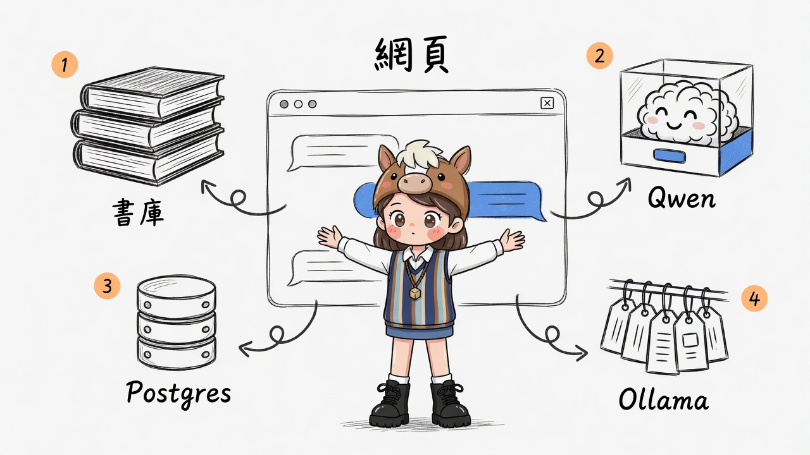
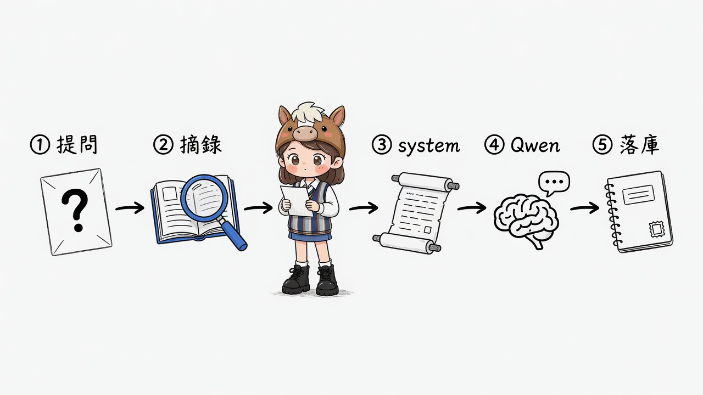
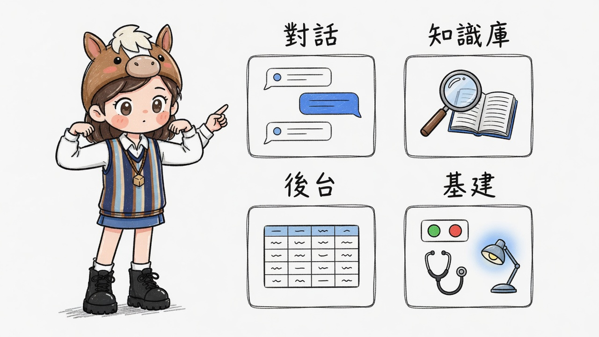

# 倪海廈 Web · 架構與說明

> 視覺總覽：[`index.html`](./index.html)  
> 配圖策略：[`assets/shot-config.md`](./assets/shot-config.md)  
> Skill 源：[jangviktor-web/nihaixia](https://github.com/jangviktor-web/nihaixia)  
> 線上預覽：https://aijackliu.github.io/cbot/test0714a/

---

## 0. 一句話

把 **倪海廈 skill 書庫** 做成一頁 Web：瀏覽器問症／問方 → 本機 Python 先 **摘錄講義** → **Qwen** 以倪師視角回答 → **PostgreSQL** 記對話；側欄可查 **Ollama 模型標籤** 與 DB 後台。



> 中央是網頁；四周是書庫 · Qwen · Postgres · Ollama——**各站其職，不混成一大坨**。配圖：gimi-illustration · quirky-sketch。

---

## 1. 系統總覽

| 角色 | 位置 | 職責 |
|------|------|------|
| **網頁 UI** | `static/index.html` | 四個分頁、探活燈、對話輸入 |
| **API** | `server.py` | CORS、靜態檔、代理 LLM/Ollama、CRUD |
| **書庫** | `nihaixia/` | 講義真相；不寫回 GitHub skill |
| **知識檢索** | `knowledge.py` | 關鍵字命中 + 摘錄進 system prompt |
| **Qwen** | `:8080` | 生成倪師視角回答 |
| **Ollama** | `:11434` | 模型列表（探活／基建頁） |
| **Postgres** | `:5432/nihaixia` | sessions · messages · notes |

---

## 2. 對話管線（一次 `/api/chat`）



> ①提問 → ②摘錄書庫 → ③倪師 system → ④Qwen → ⑤落庫。

| 步 | 做什麼 |
|----|--------|
| ① | 使用者送出訊息（可勾選「注入知識庫摘錄」） |
| ② | 掃 SKILL / modules / cases，取 top 摘錄 |
| ③ | 組 system：身份卡 + 六經速查 + **摘錄** + 免責聲明 |
| ④ | 帶近期歷史呼叫 Qwen；`enable_thinking=false` |
| ⑤ | user + assistant 寫入 `messages`；更新 `sessions.title` |

**鐵律**

1. 講義沒寫的 → 說「講義未涉及」，勿替倪師亂編。  
2. 不開可自行抓藥的臨床劑量醫囑；急重症先就醫。  
3. 密碼只在本機 `.env`，勿提交 git。

---

## 3. 四頁使用地圖



| 分頁 | 你在幹嘛 |
|------|----------|
| **對話** | 問症狀／方證；看摘錄來源 |
| **知識庫** | 直接搜講義，不經模型 |
| **後台** | 看 sessions／messages 統計與預覽 |
| **基建** | PG / Qwen / Ollama 探活 + 模型名 |

---

## 4. 本機怎麼跑（完整產品）

工作區路徑：`J:\grok\34\nihaixia-web`（非本靜態頁）。

```powershell
cd J:\grok\34\nihaixia-web
pip install -r requirements.txt
python setup_postgres.py   # 首次
.\start.ps1                # http://127.0.0.1:8790/
```

| 端點 | 預設 |
|------|------|
| Qwen chat | `http://100.88.220.82:8080/v1/chat/completions` |
| Ollama tags | `http://100.88.220.82:11434/api/tags` |
| Postgres | `100.88.220.82:5432` / `nihaixia` |
| Adminer | `http://100.88.220.82:5050` |

---

## 5. 免責

內容僅供中醫**學習研究**，不替代執業醫師診斷與處方。

---

## 6. 配圖清單

| 檔案 | 用途 |
|------|------|
| `assets/01-stack-overview.jpg` | 四端並聯 |
| `assets/02-chat-pipeline.jpg` | 五步管線 |
| `assets/03-four-panels.jpg` | 四頁地圖 |
