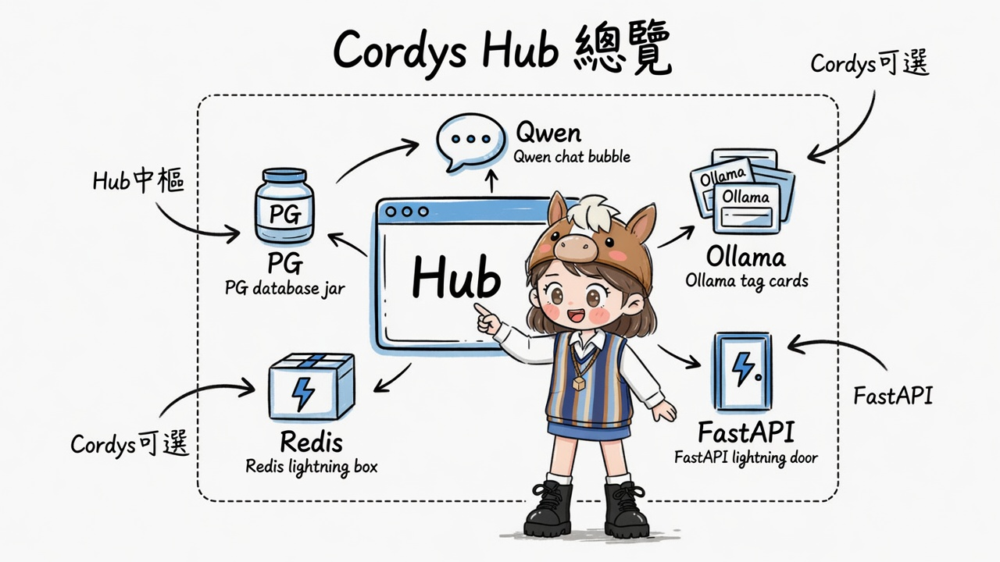
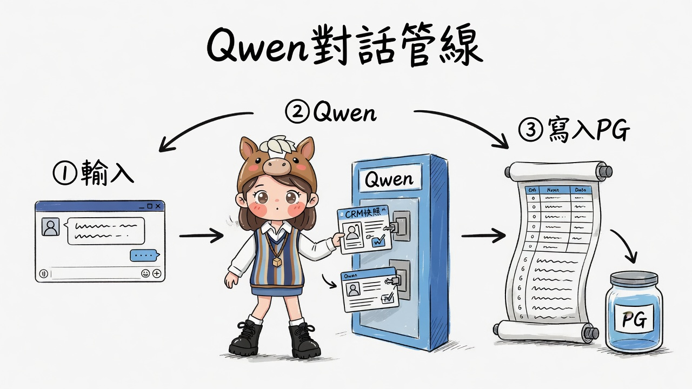
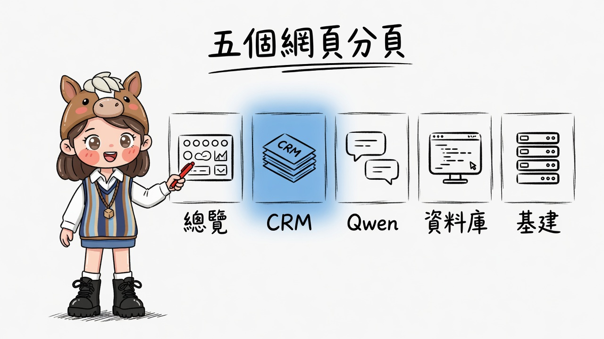
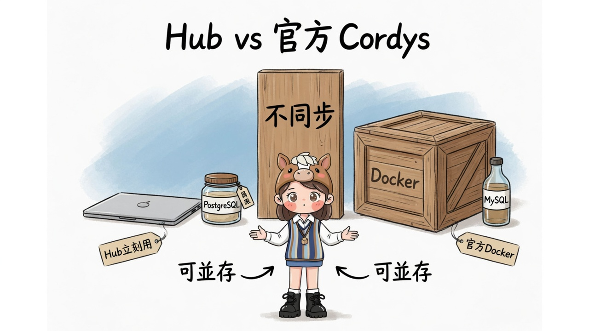

# Cordys CRM Hub · 架構說明（繁中）

> 配圖：[gimi-illustration-skill](https://github.com/GiMi-Xiaomi/gimi-illustration-skill) · quirky-sketch · Gimi  
> 本頁為靜態說明；可跑產品在工作區 `cordys-crm-hub` → `http://127.0.0.1:8791/`

---

## 一句定位

**本機 Python 網頁中樞**，串起 tailnet 上的 **PostgreSQL、Qwen、Ollama、FastAPI、Redis**，並提供輕量 CRM + 資料庫後台；官方 [CordysCRM](https://github.com/1Panel-dev/CordysCRM) 映像為**可選**完整版（需 Docker）。



---

## 一、系統總覽

| 元件 | 位址 | Hub 怎麼用 |
|------|------|------------|
| **Hub** | `127.0.0.1:8791` | 網頁 UI + API 代理 |
| **PostgreSQL** | `100.88.220.82:5432` / `cordys_hub` | 客戶／商機／活動／對話 |
| **Qwen** | `:8080/v1/chat/completions` | 銷售助理（OpenAI 相容） |
| **Ollama** | `:11434/api/tags` | 模型列表／探活 |
| **FastAPI** | `:9000` glasses_backend | 健康檢查 + OpenAPI 摘要 |
| **Redis** | `:6379` | PING／版本探活 |
| **Adminer** | `:5050` | 資料庫圖形後台連結 |
| **官方 Cordys** | `:8081`（可選） | Docker 完整 CRM，與 Hub **不同步** |

---

## 二、Qwen 對話管線



| 步驟 | 行為 |
|------|------|
| ① 輸入 | 使用者在「Qwen 助理」分頁送出訊息 |
| ② Qwen | Hub 讀 CRM 快照寫入 system → 呼叫 `:8080` |
| ③ 寫入 PG | user／assistant 寫入 `sessions` / `messages` |

---

## 三、五個網頁分頁



| 分頁 | 職責 |
|------|------|
| **總覽** | 服務燈號、統計、官方 Docker 指令 |
| **CRM** | 客戶／商機（寫 `cordys_hub`） |
| **Qwen** | 對話；可注入 CRM 快照 |
| **資料庫** | 表統計、唯讀 SELECT、Adminer |
| **基建** | Ollama／LLM／FastAPI／Redis |

---

## 四、Hub vs 官方 Cordys



| | **Hub（立刻用）** | **官方 Cordys（Docker）** |
|--|-------------------|---------------------------|
| 部署 | `python server.py` | `1panel/cordys-crm` |
| DB | **PostgreSQL** | **MySQL**（映像內） |
| AI | 接你的 **Qwen :8080** | 內建／Skills |
| 資料 | 寫 `cordys_hub` | **不與 Hub 自動同步** |
| 前提 | Tailscale 能連 100.88… | 需 **Linux + Docker** |

可並存：日常用 Hub 管商機；有主機後再上官方完整版。

---

## 五、啟動（本機產品）

```powershell
cd cordys-crm-hub
pip install -r requirements.txt
python setup_postgres.py
python server.py
# http://127.0.0.1:8791/
```

## 六、配圖索引

| # | 檔名 | 說明 |
|---|------|------|
| 01 | `01-stack-overview.jpg` | Hub 中樞與周邊服務 |
| 02 | `02-chat-pipeline.jpg` | Qwen 對話三步管線 |
| 03 | `03-five-panels.jpg` | 五個網頁分頁 |
| 04 | `04-hub-vs-official.jpg` | Hub vs 官方 Docker |

策略單：`assets/shot-config.md`
