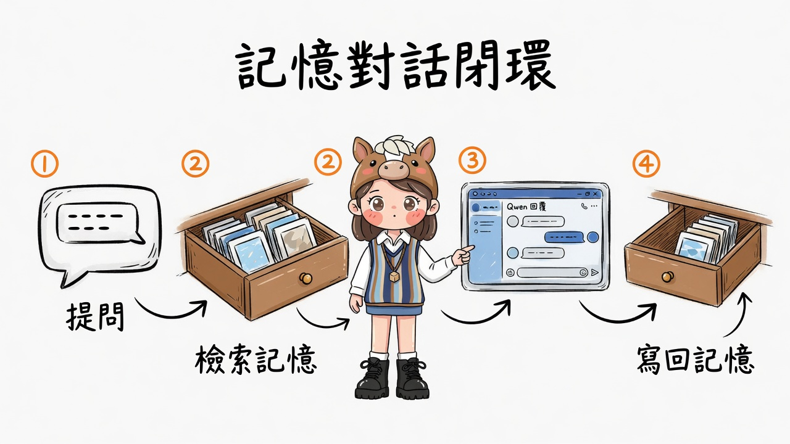
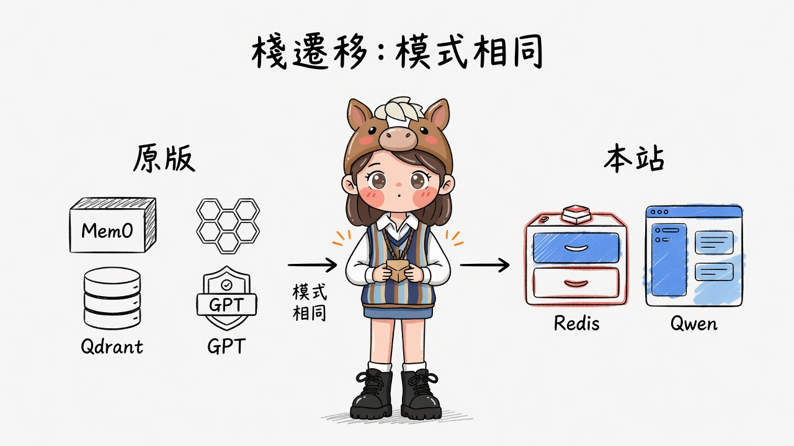
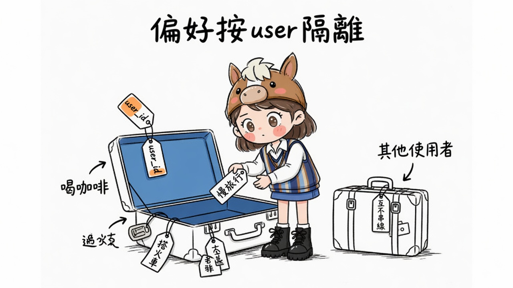

# AI 旅遊助理（記憶）· 架構與說明

> 上游：[ai_travel_agent_memory](https://github.com/Shubhamsaboo/awesome-llm-apps/tree/main/advanced_llm_apps/llm_apps_with_memory_tutorials/ai_travel_agent_memory)  
> 本站：`test0719b 說明頁 + 可運行 `test0721-marketing` · `#travel`  
> 配圖：[gimi-illustration-skill](https://github.com/GiMi-Xiaomi/gimi-illustration-skill) · quirky-sketch · IP **gimi** · 繁體標註  
> 圖檔：`assets/travel-memory/` · 策略單：`gimi-illustration-skill/outputs/20260719-travel-agent-memory/shot-config.md`

---

## 0. 一句話

**記住這位旅客的偏好，再回答行程**——不是裸聊；每次先檢索記憶，再呼叫 Qwen，最後把對話寫回。

---

## 1. 主路徑（四步閉環）



| 步 | 做什麼 | 本站實作 |
|----|--------|----------|
| ① 提問 | 使用者輸入目的地／天數／節奏 | `POST /api/travel/chat` body.message |
| ② 檢索記憶 | 依 user_id 取相關偏好 | Redis list `mkt:travel:mem:{user}` + 關鍵詞打分 |
| ③ Qwen 回覆 | 把相關記憶塞進 system／prompt | 遠端 OpenAI 相容 `/v1` |
| ④ 寫回記憶 | 存本次 user + assistant 摘要 | 同 list `lpush`；對話日誌另存 chat key |

```text
User 提問
  → search_memories(user_id, query)
  → Qwen(system=旅行助理 + 相關記憶, user=提問)
  → add_memory(user) + add_memory(assistant)
  → 回傳 reply + relevant_memories
```

---

## 2. 為什麼改寫棧（模式相同）



| | 原版教程 | 本站演示 |
|--|----------|----------|
| UI | Streamlit | 行銷站 `#travel` 區塊 |
| 記憶 | Mem0 | Redis list + 關鍵詞檢索 |
| 向量庫 | Qdrant | （演示省略向量；模式仍是「先憶後答」） |
| LLM | GPT-4o | Qwen（LAN `:8080`） |
| 隔離 | user_id | 相同：`user_id` 維度 |

**不變的判斷：** 記憶是產品能力，不是模型本身；換底座不換「記住偏好再規劃」的契約。

---

## 3. 按 user 隔離（偏好像行李牌）



- 每位旅客一個記憶箱：`mkt:travel:mem:{user_id}`  
- 示範種子（`demo_traveler`）：慢旅行、自然／咖啡、中等預算雙人、偏好火車、堅果過敏  
- 清除：`DELETE /api/travel/memory` 同時清記憶與對話  
- **互不串線**：A 的偏好不會進 B 的檢索結果  

---

## 4. 系統邊界圖

```text
瀏覽器 #travel
    │
    ▼
FastAPI (app/travel_memory.py)
    ├── Redis :6379     記憶 list / 對話 log / users set
    └── Qwen  :8080/v1  行程生成（可抽 reasoning_content）
```

與站內其他模組關係：

| 模組 | 關係 |
|------|------|
| catch_crm / Postgres | 不寫入；旅遊記憶獨立於 CRM |
| RAG / Ollama embed | 不混用；旅行記憶走 Redis 關鍵詞，非向量 KB |
| 診斷診所 | 無關；診所管 RAG 故障模式 |

---

## 5. API 速查

| 方法 | 路徑 | 說明 |
|------|------|------|
| POST | `/api/travel/seed` | 寫入示範偏好（已存在則不重複） |
| GET | `/api/travel/memory` | 列出記憶 |
| DELETE | `/api/travel/memory` | 清空記憶 + 對話 |
| POST | `/api/travel/chat` | 檢索 → 生成 → 寫回 |
| GET | `/api/travel/history` | 近期對話 |

---

## 6. 演示腳本（對外講 60 秒）

1. 打開 `#travel`，user 填 `demo_traveler`  
2. **載入示範記憶** → 左側出現慢旅行／咖啡／火車等  
3. 問：「京都三天，慢節奏」  
4. 狀態列顯示「用到 N 條相關記憶」→ 回覆應避開趕行程、可提火車／咖啡  
5. 換 user 名再問 → 記憶箱是空的（隔離）  

---

## 7. 商機與邊界

- **可賣點**：Long-term preference memory 接到垂直助理（旅遊／保險／客服）  
- **演示邊界**：關鍵詞記憶 ≠ 生產級向量 Mem0；要升格可換回 Qdrant／embedding  
- **合規**：偏好與過敏屬個人資料；正式環境需同意與 TTL  

---

## 配圖索引

| 檔案 | 主題 |
|------|------|
| `01-memory-loop.jpg` | 四步記憶對話閉環 |
| `02-stack-adapt.jpg` | 原版 vs 本站棧，模式相同 |
| `03-user-isolation.jpg` | user_id 隔離與偏好行李牌 |

IP 與授權說明見 skill 倉 `IP-NOTICE.md`。
